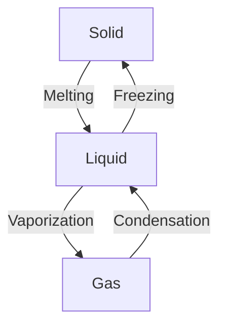

```toc
```


## Thermal Physics


---
#### 2.1 [[Kinetic Particle Model of Matter]]
![[00_MOC-20250305173701078.png]]
![[00_MOC-20250305173802137.png]]

- All [[matter]] consists of particles in constant [[motion]] (except at absolute zero)
- Explains behavior of [[solid]], [[liquid]], and [[gas]] states
![[IMG_4865.jpeg]]

| Property        | [[Solid]]            | [[Liquid]]          | [[Gas]]             |
| --------------- | -------------------- | ------------------- | ------------------- |
| **Arrangement** | Fixed lattice        | Random              | Random              |
| **Movement**    | Vibrational          | Sliding flow        | Free random         |
| **[[Energy]]**  | Low                  | Medium              | High                |
| **[[Density]]** | $\rho_{\text{high}}$ | $\rho_{\text{med}}$ | $\rho_{\text{low}}$ |



---
- During phase transitions:
  - [[Temperature]] remains constant
  - Thermal [[energy]] changes potential [[energy]] (spacing) not kinetic [[energy]]
  $$Q = mL$$
 **[[Brownian Motion]]**
> [!definition] 
> Random [[motion]] of macroscopic particles caused by collisions with microscopic particles:  

![[Brownian Motion-20250305213443477.png|400]]


---
#### 2.2 [[Thermal Properties and Temperature]]
![[00_MOC-20250305173833683.png]]

*[[Temperature]] =>*
**the average kinetic [[energy]] of particles in a substance**

- On the thermodynamic (Kelvin) [[temperature]] scale, **absolute zero** refers to the lowest possible [[temperature]] 
- This is equal to 0 K or −273 °C
- It is not possible to have a [[temperature]] lower than 0 K
- A [[temperature]] in Kelvin will **never** be negative

>[!def] Absolute Zero
>**The [[temperature]] at which molecules in a substance have zero kinetic [[energy]]** 
> - No more [[energy]] can be removed from a system at 0 K
- Space [[temperature]] ≈ 2.7 K (just above absolute zero)
$$
\theta \,/\, ^\circ\text{C} = T \,/\, \text{K} - 273 \\
T \,/\, \text{K} = \theta \,/\, ^\circ\text{C} + 273
$$
**[[Thermal Expansion]]**
- [[Atoms]] vibrate more → increased volume
- Reverse = thermal contraction
- **Greatest in gases**, smallest in solids

**Consequences**
1. **Slack overhead cables** allow contraction on cold days

![[Thermal Properties and Temperature-20250305224640282.png]]

1. **Gaps in bridges** allow expansion on hot days

![[Thermal Properties and Temperature-20250305224631483.png]]

  

---


>[!def] [[Specific Heat Capacity]]
>[[Energy]] required to raise 1 kg of substance by 1°C (material property)
$$E = mc\Delta T$$
- **$c$** = [[specific heat capacity]] (J/kg°C)

**Water's high $c$** → heats/cools slower than metals

---

>[!def] [[Thermal Capacity]]
>[[Energy]] needed to raise **an object's** [[temperature]] by 1°C (depends on [[mass]])
$$E = C\Delta T \quad \text{where } C = mc$$
- Unit: **J/°C**

---

**Changes of State**
- **No [[temperature]] change** during state transitions
- [[Energy]] formula:

$$Q = mL$$

- **$L$** = [[specific latent heat]] (J/kg)
- *Fusion* (melting)
- *Vaporization* (boiling)


| **State of [[Matter]]**                | **[[Solid]]**                                                                                                                                                                                                           | **[[Liquid]]**                                                                                                                                                                                                            | **[[Gas]]**                                                                                                                                                                                                         |
| ---------------------------------- | ------------------------------------------------------------------------------------------------------------------------------------------------------------------------------------------------------------------- | --------------------------------------------------------------------------------------------------------------------------------------------------------------------------------------------------------------------- | --------------------------------------------------------------------------------------------------------------------------------------------------------------------------------------------------------------- |
| Particle arrangement               | Fixed pattern (lattice structure)                                                                                                                                                                                   | Random                                                                                                                                                                                                                | Random                                                                                                                                                                                                          |
| Space between particles            | No space                                                                                                                                                                                                            | Some space                                                                                                                                                                                                            | Large space                                                                                                                                                                                                     |
| Particle movement                  | Vibrates around a fixed position                                                                                                                                                                                    | Flows past each other                                                                                                                                                                                                 | Moves around at different speeds                                                                                                                                                                                |
| Particle [[energy]]                    | Low                                                                                                                                                                                                                 | Medium                                                                                                                                                                                                                | High                                                                                                                                                                                                            |
| Substance shape                    | Fixed                                                                                                                                                                                                               | Not fixed                                                                                                                                                                                                             | Not fixed                                                                                                                                                                                                       |
| Substance volume                   | Fixed                                                                                                                                                                                                               | Fixed                                                                                                                                                                                                                 | Not fixed                                                                                                                                                                                                       |
| Substance [[density]]                  | High                                                                                                                                                                                                                | Medium                                                                                                                                                                                                                | Low                                                                                                                                                                                                             |
| 2D diagram of particle arrangement |  |  |  |

#### [[Heating Curve]]


>[!def] [[Internal Energy]]
>**Total kinetic + potential [[energy]] of particles**- Increases with added thermal [[energy]]

#### Components
1. **Kinetic [[energy]]** → [[temperature]] change ($\uparrow$ KE = $\uparrow$ temp)
2. **Potential energy** → state changes (no temp change)


[[evaporation]]

#### [[Cooling Effect of Evaporation]]


---

#### 2.3 Transfer of Thermal Energy
![[02_areas/PHYSICS/2/attachments/image.png]]
![[02_areas/PHYSICS/2/attachments/image-1.png]]


[[02_areas/PHYSICS/2/Conduction|Conduction]]
[[Convection]]
[[Radiation]]
[[Consequences of Thermal Energy Transfer]]
