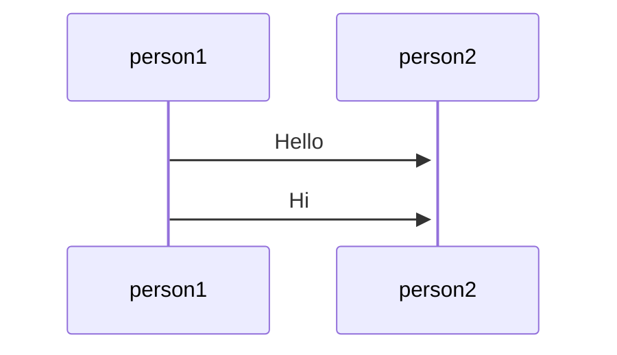
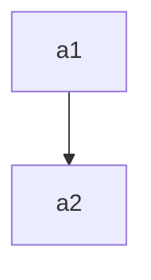

text
```table-of-contents
```


‘# HEADINGS’

# This is a heading 1 
## This is a heading 2 
### This is a heading 3 
#### This is a heading 4 
##### This is a heading 5 
###### This is a heading 6

```
# This is a heading 1 
## This is a heading 2 
### This is a heading 3 
#### This is a heading 4 
##### This is a heading 5 
###### This is a heading 6
```

!there is a space after the hashtags!!

```
bold - **text** || __text__
italic - *text* ||  _text_

strikethrough -    ~~text~~
highlight -        ==text==

can be nested
to type the specific special characters, add \ in front
```


# INTERNAL LINKS
## files
Wikilink: [[99_TO_DO]]
```
[[TO_DO]]
```
Markdown: [to do list](99_TO_DO.md)
for spaces in file names - replace space with %20
or you can
```
[[file|name]]
```
[[!HOW TO MARKDOWN!|name]]
```
[to do list](TO_DO.md)
```
just use wikilinks tbh
## heading in note
you can link to specific headings in notes also known as
### anchor links
#### linking to heading within the same note
type`[[#`   to get a list of headings within the note to link to]]
[[#INTERNAL LINKS]]
#### linking to heading in another note
add a hash `#` at the end of the link destination, followed by the heading text.
[[99_TO_DO#gaming]]


# external links
```
[display name here](link here)
ex. [google](https://www.google.com)
```
## images
```
add a ! before the link to image
```
for image resizing check [[Obsidian Settings and Plugins]] plugin resizer
or
add dimensions to the image link like this (ex. 640x480)
```

```
you also can only specify the width and the image will scale with its original aspect ration like this
```

```


# QUOTES
>quotes
>hello world

\- hi

```
>quotes
>hello world
\- hi
```

# LISTS
### unordered list
add `-` ,`*`, or `+` before the text REMEMBER SPACE AFTER
ex.
```
- first unordered list item
- second unordered list item
- third unordered list item
```
- first unordered list item
- second unordered list item
- third unordered list item

### ordered list
start each list item with a number followed by a `.`
ex.
```
1. first list item
2. second list item
3. third list item
```
1. first list item
2. second list item
3. third list item

### task lists
to create a task list, start each list item with a hyphen `-` and a space followed by brackets `[ ]`
ex.
```
- [x] This is a completed task
- [ ] This is an incomplete task
```

- [x] This is a completed task
- [ ] This is an incomplete task

You can toggle the task button in reading view.
You can use any character inside the brackets to mark it as complete

## Nesting lists
all list types can be nested
To create a nested list, indent one or more list items
ex.
```
1. first list item
	1. ordered ensted list item
2. second list item
	- unordered nested list item
```

1. first list item
	1. ordered ensted list item
2. second list item
	- unordered nested list item
similarly, you can create nested task list by indenting one or more list items
ex.
``` 
- [ ] task item 1
	- [ ] subtask 1
- [ ] task item 2
	- [ ] subtask 1
```
- [ ] task item 1
	- [ ] subtask 1
- [ ] task item 2
	- [ ] subtask 1

# INDENTING
Use `TAB` or `SHIFT + TAB` to indent or unindent


# HORIZONTALS
you can use three or more stars `***`, hyphens `——-`, or underscores `___` on its own line to add a horizontal bar, you can also separate the symbols using spaces.
ex.
```
***
****
* * *
---
--—
- - -
___
____
_ _ _
```
---


# CODE
you can format code both inline within a sentence or in its own block.
```
```
## inline code
you can formate code within a sentence using single backticks ”\`”.
```
text inside `backticks` on a line will be formatted like code.
```

## code blocks
to format a block of code, surround the code with triple backticks.
```
\```
cd ~/Desktop
\```
```
You can also create a code block by indenting the text using `TAB` or 4 blank spaces. (?)
    cd ~/Desktop

## syntax highlighting
you can add syntax highlighting to a code block by adding a language code after the first set of backticks
ex.
```js
function printstuff(text){
	if(text){
		console.log(text);
	}
}
```
Obsidian uses Prism for syntax highlighting
[supported languages](https://prismjs.com/#supported-languages)
source mode and live preview may render syntax highlighting differently.


# FOOTNOTES
you can add footnotes with the following syntax
```
this is a simple footnote[^1].

[^1]: This is the referenced text.
[^2]: Add 2 spaces at the start of each new line
  This lets you write footnotes that span multiple lines.
[^note]: Named footnotes still appear as numbers, but can make it easier to identify and link references.
```
this is a simple footnote[^1][^note].

[^1]: This is the referenced text.
[^2]: Add 2 spaces at the start of each new line
  This lets you write footnotes that span multiple lines.
  line
  line
[^note]: Named footnotes still appear as numbers, but can make it easier to identify and link references.

You can also inlines footnotes in a sentence, note that the caret`^` goes outside the brackets.
```
inline footnotes. ^[This is an inline footnote.]
```
inline footnotes. ^[this is an inline footnote.]
inline footnotes only work in reading view, not in live preview.


# COMMENTS
you can add comments by wrapping text with `%%`. comments are only visible in editing view.
```
this is an %%inline%% comment.

%%
this is a block comment.

block comments can span multiple lines.
%%
```

this is a(n) %%inline%% comment.

%%
this is a block comment.

block comments can span multiple lines.
%%

# TABLES
you can create tables using vertical bars `|` and hyphens `-`. vertical bars separate columns and hyphens define the column header.
ex.
```
| column1 | column2 |
| ——————— | ——————- |
| item    | item    |
| item    | item    |
```
however the lines do not have to be perfectly aligned
and the vertical bars on either side are optional
so practically you can do this
```
column1 | column2
-- | —-
item | item
item | item
```
column1  |  column2
--  |  --
item  |  item
item  |  item

tables can be viewed better in reading mode.

you can also use advanced tables plugin [[Obsidian Settings and Plugins]]
You can use basic formatting syntax to style content within a table.
ex. links and embed files
HOWEVER, if you need to resize/use aliases in the table, you need to add a `\` before the vertical bar.
### aligning
you can align text to the left, right, or center of a column by adding colons `:` to the header row.
ex.
```
left-aligned text | center-aligned text | right-aligned text
:-- | :--: | --:
text | text | text
```
left-aligned text | center-aligned text | right-aligned text
:-- | :--: | --:
text | text | text


# DIAGRAMS
## Mermaid
Mermaid supports a range of diagrams, such as flow charts, sequence diagrams, and timelines.
[more info here](https://mermaid.js.org/syntax/flowchart.html#classes)
to add a Mermaid diagram, create a mermaid code block like this below




# LaTeX notations
you can add math expressions to your notes using MathJax and the LaTeX notation.
To add a MathJax expression to your note, surround it with double dollar signs `$$`.
ex.
```
$$
\begin{vmatrix}a & b\\
c & d
\end{vmatrix}=ad-bc
$$
```
$$
\begin{vmatrix}a & b\\
c & d
\end{vmatrix}=ad-bc
$$
you can also inline math expressions by wrapping it in dollar sign `$` symbols.
ex.
`This is an inline math expression $e^{2i\pi} = 1$.`
This is an inline math expression $e^{2i\pi} = 1$.

For more information about the syntax, refer to [MathJax basic tutorial and quick reference](https://math.meta.stackexchange.com/questions/5020/mathjax-basic-tutorial-and-quick-reference)
#todo write if needed

For a list of supported MathJax packages, refer to [The TeX/LaTeX Extension List](https://docs.mathjax.org/en/latest/input/tex/extensions/index.html)


# CALLOUTS
use callouts to include additional content without breaking the flow of your notes. (like a reminder box/sticky note)

to create a callout, add `[!info]` to the first line of a block-quote, where `info` is the *type identifier*. The type identifier determines how the callout looks. 
```
> [!info]
> info here!
```

> [!info]
> info here!
### supported types
[[#customizing callouts]]
	you can use several default callout tupes, each comes with a different background color and icon.
```
[!note]
[!summary]/[!abstract]/[!tldr]
[!info]
[!todo]
[!tip]/[!hint]/[!important]
[!success]/[!check]/[!done]
[!question]/[!help]/[!faq]
[!warning]/[!attention]/[!warning]
[!failure]/[!fail]/[missing]
[!error]/[!danger]
[!bug]
[!example]
[!quote]/[!cite]
```
ex.
```
> [!info]
> here is a callout block.
> it supports **markdown**, [[!HOW TO MARKDOWN!|internal links]], and embeds
```
> [!info]
> here is a callout block.
> it supports **markdown**, [[!HOW TO MARKDOWN!|internal links]], and embeds

## change the title
you can change the title by adding the text after the type identifier
ex.
```
> [!tip] custom title
> like this one
```
> [!tip] custom title
> like this one

### foldable callouts
you can make a callout foldable by adding a plus `+` or minus `-` directly after the type identifier.
a plus sign `+` expands the callout by default, and a minus `-` sign collapses it instead.
```
>[!question]- foldable?
>yes
```
>[!question]- foldable?
>yes

### nested callouts
yes you can
```
> [!question] can callouts be nested?
> > [!todo] yes!
> > > [!example] and again!
```
> [!question] can callouts be nested?
> > [!todo] yes!
> > > [!example] and again!

## customizing callouts
[[!CSS!]] snippets and plugins can define custom callouts.
To define a custom callout, create the following CSS block:
```css
.callout[data-callout="custom-question-type] {
	--callout-color: 0, 0, 0;
	--callout-icon: lucide-alert-circle;
}
```
for this example, we created a custom type identifier going by the name `[!custom-question-type]`. callout color sets the background color using RGB value and icon can be an icon from [https://lucide.dev](https://lucide.dev/) or a SVG file